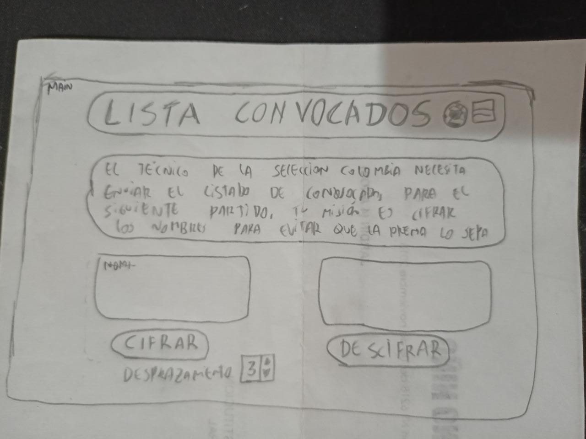
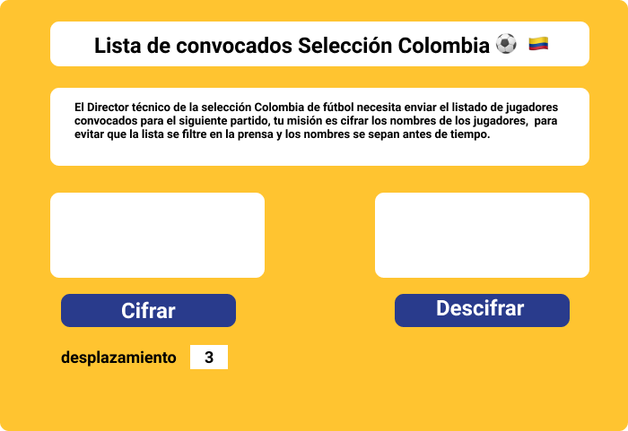

# Cifrado César

## 1. Descripción del proyecto

  Se acerca la [copa América de fútbol 2021](https://es.wikipedia.org/wiki/Copa_Am%C3%A9rica_2021) y el entrenador de la selección Colombia de fútbol debe enviar el listado de los jugadores convocados para este torneo, sin embargo no desea que la listada sea filtrada por la prensa. entonces busca enviar la lista de manera cifrada a la federación colombiana de fútbol.

## 2. Investigación UX

- **Usuarios**: Asistente del director técnico de la selección Colombia, y directivos de la Federación Colombiana de fútbol.
- **Objetivo**: poder enviar de manera cifrada la lista de jugadores para evitar que se filtre el listado antes del anuncio oficial.
- **Problema a Solucionar**: Cuando el técnico envía por correo el listado, muchas veces personas malintecionadas interceptan la comunicación, o buscan personas cercanas a los directivos quienes aprovechan cualquier ocasión para ver "por encima del hombro" el listado. con esta lista cifrada, sólo el directivo encargado de comunicaciones podrá saber el listado de antemano y podrá hacer el anuncio público sin que se filtre la lista

- **Prototipo en Papel** (baja fidelidad)

- Feedback recibido: luce bien, cumple el objetivo.

- **Prototipo en Figma** (alta fidelidad)

[Prototipo en Figma.](https://www.figma.com/file/XdIhZ7AhEc5HfpxliAJ7k6/Cipher)

## 3. plan de acción

Objetivos de aprendizaje

### HTML y CSS

* [ ] [Uso de HTML semántico.](https://developer.mozilla.org/en-US/docs/Glossary/Semantics#Semantics_in_HTML)

* [ ] Uso de selectores de CSS.

* [ ] Construir tu aplicación respetando el diseño realizado (maquetación).

### DOM

* [ ] Uso de selectores del DOM.

* [ ] Manejo de eventos del DOM.

* [ ] [Manipulación dinámica del DOM.](https://developer.mozilla.org/es/docs/Referencia_DOM_de_Gecko/Introducci%C3%B3n)

(appendChild |createElement | createTextNode| innerHTML | textContent | etc.)

### JavaScript

* [ ] Manipulación de strings.

* [ ] Uso de condicionales (if-else | switch | operador ternario)

* [ ] Uso de bucles (for | for..in | for..of | while)

* [ ] Uso de funciones (parámetros | argumentos | valor de retorno)

* [ ] Declaración correcta de variables (const & let)

### Testing

* [ ] [Testeo unitario.](https://jestjs.io/docs/es-ES/getting-started)

### Estructura del código y guía de estilo

* [ ] Organizar y dividir el código en módulos (Modularización)

* [ ] Uso de identificadores descriptivos (Nomenclatura | Semántica)

* [ ] Uso de linter (ESLINT)

### Git y GitHub

* [ ] Uso de comandos de git (add | commit | pull | status | push)

* [ ] Manejo de repositorios de GitHub (clone | fork | gh-pages)

### UX

* [ ] Diseñar la aplicación pensando y entendiendo al usuario.

* [ ] Crear prototipos para obtener feedback e iterar.

* [ ] Aplicar los principios de diseño visual (contraste, alineación, jerarquía)

